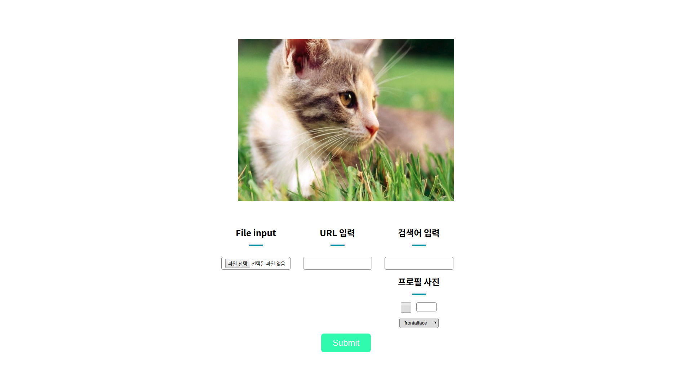

# 2016 봄 SPARCS 신입생 프로젝트
made by 백용수(bloo), 조희상(nick)

### Ruby on rails
```
#version info

ruby 2.3.0p0
rails 4.2.5
gem 2.5.1
```
### 사이트 기능
##### General
인물 사진을 입력받아 인물의 얼굴과 신체를 인식하여 적당한 위치에 고양이 귀나 하트 등을 합성해주는 웹사이트

##### Detail
사진을 입력하는 방법은 세 가지가 있다.
1. 사진 파일 직접 업로드(메인화면 좌측)
2. 사진 url 입력(메인화면 중앙)
3. 네이버 검색 api를 이용한 파싱
  * **프로필사진**을 체크하면 네이버 검색시 나오는 프로필 사진을 직접 파싱해옴

마지막으로 좌측 하단 드롭다운을 통해 인식하고 합성할 신체부위를 고를 수 있다.

만약 합성할 이미지가 없는 신체부위를 고르면 그 신체 부위를 지정하는 바운딩 박스만 사진에 합성된다.

고양이는 귀여워서 넣었다.


